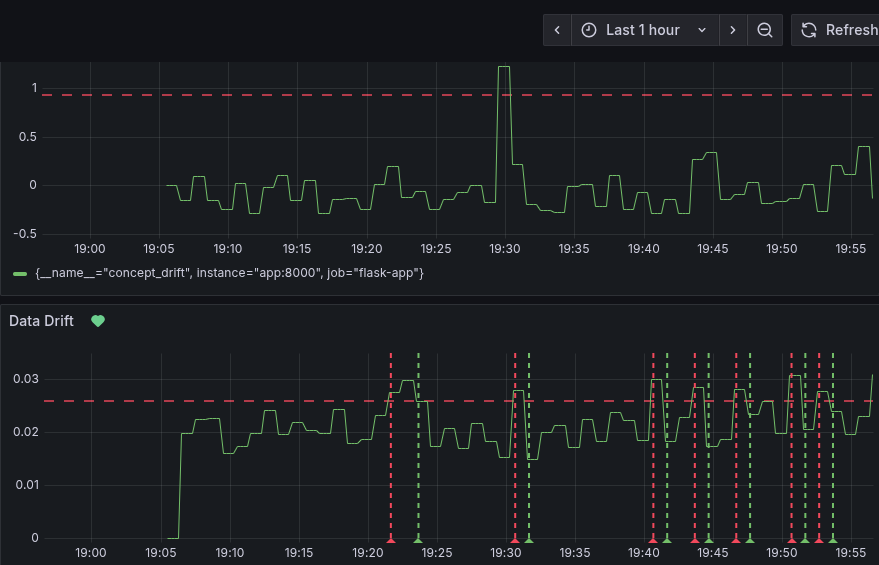
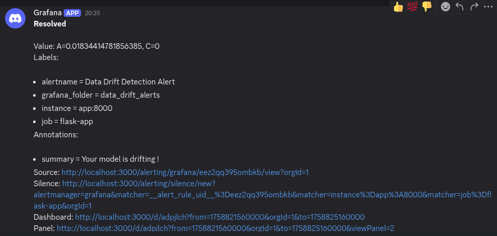

# ML Performance Monitoring with Grafana



This repository contains a Dockerized service for serving a regression model and monitoring its performance in production. The core components include:
- A **Flask REST API** that serves model predictions through endpoints.
- A **monitoring system** that generates new sample data and logs [data drift](https://www.datacamp.com/tutorial/understanding-data-drift-model-drift) and [concept drift](https://en.wikipedia.org/wiki/Concept_drift) metrics.
- A **Grafana** dashboard for visualizing these metrics in real-time.
- An **alert pipeline** that triggers notifications to a Discord channel whenever monitored metrics exceed a threshold value.
- A containerized application (**Docker** and **Docker Compose**) for consistent deployment.


## Docker Install (recommended)

1. Clone the repository

```
git clone https://github.com/PierreExeter/ML-Performance-Monitoring-with-Grafana.git
```

2. Build the image

```
docker compose build
```

3. Launch the Docker container
```
docker compose up -d
```

There should be 3 services running on these URLs:
- Flask application: [http://localhost:5000/metrics](http://localhost:5000/metrics)
- Prometheus client: [http://localhost:9090](http://localhost:9090/)
- Grafana server: [http://localhost:3000/](http://localhost:3000/)

4. Close the app
```
docker compose down
```

## Local Install

1. Clone the repository

```
git clone https://github.com/PierreExeter/ML-Performance-Monitoring-with-Grafana.git
```

2. Install the dependencies

```
conda create -n grafana-env python=3.13 -y
conda activate grafana-env
pip install -U -r requirements.txt
```

3. Start the Grafana server 

Install [Grafana](https://grafana.com/docs/grafana/latest/setup-grafana/installation/)

```
sudo systemctl start grafana-server
sudo systemctl enable grafana-server
```

Open browser to [http://localhost:3000/](http://localhost:3000/)

5. Start the Prometheus instance

- Download [Prometheus](https://prometheus.io/download/)
- Unpack the downloaded tarball
```
tar xvfz prometheus-*.tar.gz
```

- Start the Prometheus instance
```
cd prometheus-*
./prometheus --config.file=./prometheus.yml
```

Open browser to [http://localhost:9090](http://localhost:9090)

6. Train the ML model

```
python src/train.py
```

7. Run the Flask application

```
python src/app.py
```

Open browser to [http://localhost:5000/metrics](http://localhost:5000/metrics). This should show a text file with the Prometheus scrape details.

8. Close the app

- Stop Flask app with CTRL + C
- Stop the Prometheus instance with CTRL + C
- Stop the Grafana server :
```
sudo systemctl stop grafana-server
```

## Grafana Dashboard Setup

1. Head to the Grafana UI page and log in (by default, username: admin, password : admin)

2. Connect to Prometheus

- On the left side, go to Connections > Data Sources > Prometheus 
- Enter the Prometheus Server URL in the connection field : http://prometheus:9090
- Click Save and Test

3. Create a Grafana Dashboard and visualisations

- Click on the "+" > New dashboard
- Click on "Add visualisation"
- Select Metric "data_drift"
- Click "run queries"
- On the right hand panel, scroll down to 'Threshold' and add a threshold at 0.026.
- select "show threshold" As lines (dashed)
 
 
4. Do the same for the concept_drift metric
- Click on "Add visualisation"
- Select Metric "concept_drift"
- Click "run queries"
- On the right hand panel, scroll down to Threshold and add a percentage threshold at 80%.
- Select "show threshold" As lines (dashed)
- Name your dashboard "ML-model-monitoring" 
- Click on "save dashboard"
 

## Discord Alerts Setup

Set up a Discord alert that triggers notifications when the drift metrics exceed a threshold value.


 
1. Create a new Discord server
- Log in to [Discord](https://discord.com/)
- In the bottom left corner, click on "Create server"
- Choose "Create my own" and "For me and my friends" options
- Name the server as "Grafana alerts"

2. Create a new Discord channel and webhook
- In the top left, click on the "+" (next to “Text channels")
- Name the channel "grafana-alerts"
- Click on the blue "Edit channel" button
- Switch to the "Integrations" tab and click on "Create Webhook"
- Click on the webhook and copy its URL


3. Create a contact point in Grafana that fires alerts to Discord
- In the Grafana UI, go to Home > Alerting > Contact points
- Click on "+ Add contact point"
- Name it "Discord alerts"
- Choose "Discord" as the integration type
- Paste the Discord webhook URL
- Click on "Test" to send a test alert to the Discord channel
- Check that the alert was received by the Discord channel
- Go back to Grafana and click on "Save contact point"


4. Create alerting rules for the data drift metric

- Go to "Home > Dashboards > ML-model-monitoring"
- Click "Edit" on the data drift visualisaton 
- Switch to the "Alert" tab and click on "New alert rule"
- Name the new rule "Data Drift Detection Alert"
- Under "2. Define query and alert condition", click on "Code" and then "Run queries". This will choose the "data_drift" metric as the first input to the alert.
- Set alert condition : WHEN QUERY Is above 0.026. An alert will be fired when the drift score exceeds that amount. 
- Click "Preview alert rule condition"
- Under "3. Add folder and labels", create a new folder called "data_drift_alerts"
- Under "4. Set evaluation behavior", create a new evalutation group called evaluation-data-drift with a 1m interval
- Set “Pending period" to "None". This causes alerts to fire immediately when the condition is met.
- Under "5. Configure notifications", select "Discord alerts" as the contact point.
- Under "6. Configure notification message", add a summary that will be displayed in the alert message (eg. "Your model is drifting !")
- Click on “Save rule and exit".


5. Repeat the steps for the concept drift metric

6. Click on "save dashboard"


